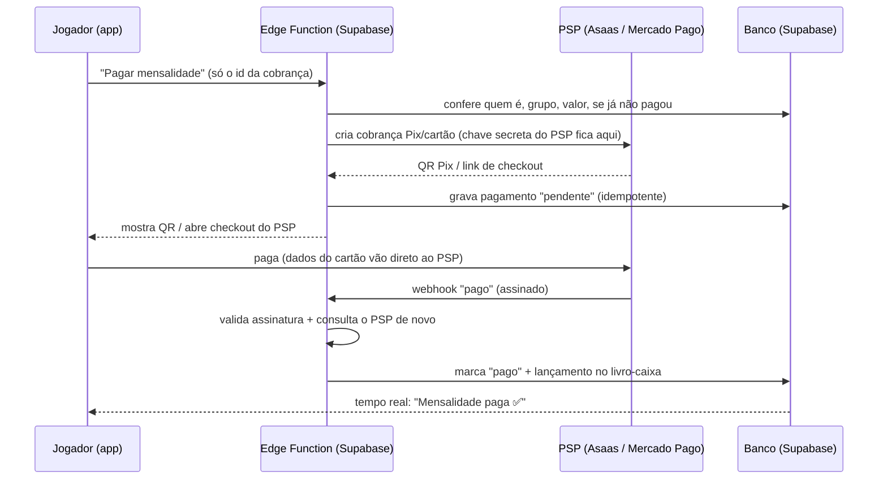

# Segurança e privacidade do Vaia Aí

Como o app protege senhas, dados pessoais e (no futuro) dinheiro. Vale para qualquer
pessoa ou sessão que mexer no projeto: **toda mudança nova precisa respeitar as regras daqui**.

---

## 1. Princípios

1. **Menos dados é mais seguro.** Só guardamos o que o app usa. Endereço exato, CPF e cartão: **nunca**.
2. **O banco é quem decide.** Regras de acesso ficam no Supabase (RLS e funções), não só nas telas.
   Um app modificado ou uma chamada direta à API não passa dessas regras.
3. **Privado por padrão.** Aparecer para desconhecidos, mostrar WhatsApp e região: tudo começa **desligado**.
4. **Uma porta por tipo de dado sensível.** Perfis dos outros só saem pela função `people()`; cada
   campo sensível tem uma regra escrita.
5. **Dinheiro nunca passa por código nosso rodando no celular.** Chaves de pagamento só no servidor.

---

## 2. Mapa dos dados

| Dado | Onde fica | Quem vê | Proteção |
|---|---|---|---|
| E-mail e senha | Supabase Auth | Só a própria pessoa | Senha com hash bcrypt pelo Supabase; nunca passa pelo nosso código |
| Sessão (token de login) | Celular | App | Cifrada com AES-256; chave no cofre do sistema (Keychain/Keystore) |
| Nome, apelido, posição, fotos, bio, habilidades | `profiles` | Colegas de grupo/comunidade e quem conversa com a pessoa | RLS + colunas liberadas |
| Idade | Calculada | Os mesmos acima | A **data de nascimento** não sai; só a idade, por `people()` |
| Telefone e Instagram | `profiles` (colunas privadas) | A própria pessoa; o **organizador** dos grupos dela; quem **conversa** com ela **se ela liberou** | Sem SELECT direto; só via `people()` |
| Peso, data de nascimento | `profiles` (colunas privadas) | Só a própria pessoa | Sem SELECT direto |
| Região (bairro + posição ~1 km) | `profiles` (colunas privadas) | Ninguém vê a posição; o bairro aparece para quem pode ver o perfil | Coluna arredonda para 2 casas; distância calculada no servidor |
| Fotos | Storage `avatars` | Quem tiver o link | Pasta por usuário; só o dono envia/apaga (link público, ver riscos) |
| Jogos, presença, placar, notas | Tabelas do grupo | Membros do grupo | RLS por grupo; só admin escreve |
| Caixa (mensalidades, despesas, chave Pix) | Tabelas do grupo | Membros do grupo | RLS; comunidade **não** vê ajustes de outros times |
| Convidados sem conta | `guests` | Membros veem nome/posição; **telefone só admin** | Coluna `phone` sem SELECT; `guest_contacts()` só para admin |
| Curtidas, matches | `swipes` | Cada um só as próprias | RLS; match calculado no servidor |
| Mensagens do chat | `messages` | Só as duas pessoas | RLS; enviar só se `can_chat()`; equipe não lê (só trechos anexados a denúncias) |
| Denúncias | `reports` | Só a equipe (painel) | Usuário só consegue criar |

---

## 3. Senhas e login
- Supabase Auth guarda só o **hash** (bcrypt). Ninguém da equipe consegue ver senha.
- App exige **8+ caracteres com letras e números** no cadastro. ⚠️ Configure o mesmo no painel (seção 10).
- Sessão cifrada no celular (`src/lib/secureStorage.ts`); renovação automática só com o app aberto.
- Próximos passos: confirmação de e-mail (precisa de SMTP próprio), CAPTCHA no cadastro, login Google/Apple.

## 4. No celular
- Sessão: cifrada (AES-256 + cofre do sistema).
- Cache do grupo (para abrir rápido e sem internet) fica no armazenamento do app, **sem cifra**. É apagado
  ao sair da conta. Protegido pelo isolamento do sistema operacional (outros apps não leem).
- Fotos só saem do celular quando a pessoa escolhe. Localização só quando toca em "Usar minha localização", e
  **nunca em segundo plano**.

## 5. No servidor (Supabase)
- **RLS em todas as tabelas.** Tabela nova sem RLS = bug de segurança.
- **Funções `security definer`** fazem as regras que o RLS sozinho não expressa (ex.: `people()`, `swipe()`,
  `can_chat()`). Todas com `set search_path = public`, sem acesso para `anon`.
- **Limites de uso** (anti-spam, `rate_limit()`): 20 mensagens/min e 1000/dia, 300 curtidas/dia,
  5 vagas/dia, 20 denúncias/dia, 10 grupos e 5 comunidades por dia.
- **Validação no banco**: tamanhos máximos de texto, faixas de valores, maioridade para descoberta.
- Toda migração passa por `npm run check:sql` (parser oficial do Postgres) antes de ir para o dono rodar.

## 6. Chaves e segredos
- O repositório é **público**. Pode ter: URL do Supabase e a chave **publishable** (feita para ficar no app;
  quem protege é o RLS).
- **Nunca** pode ter: chave `service_role`/`sb_secret_`, chaves de pagamento, tokens do Expo/Google/Apple,
  senhas. O hook de pre-commit (`npm run check:secrets`) bloqueia o commit se achar algo assim.
- Segredos do servidor ficam em **Supabase → Edge Functions → Secrets**. Do build, em **EAS → Secrets**.
- Vazou? Troque a chave no painel **na hora** (apagar do Git não basta: o histórico é público).

## 7. LGPD: direitos já no app
- **Acesso e portabilidade:** Meu perfil → *Baixar meus dados* (`export_my_data()`).
- **Correção:** Editar perfil.
- **Eliminação:** Meu perfil → *Excluir minha conta* (apaga perfil, fotos, participação, matches e mensagens;
  grupos e comunidades passam para outro membro).
- **Revogar consentimento:** desligar região, "Aparecer", WhatsApp, apagar fotos e dados opcionais.
- Política de privacidade e termos: `src/legal/content.ts` → `npm run legal` gera `docs/`.

## 8. Moderação e incidentes
- Denúncia bloqueia na hora para quem denunciou e vai para `reports` com as últimas mensagens da pessoa.
- **Se houver vazamento ou invasão:**
  1. Trocar as chaves no Supabase (Settings → API) e revogar sessões (Authentication → Users → Sign out all).
  2. Descobrir o que foi exposto (logs do Supabase).
  3. Avisar os afetados e a **ANPD** em prazo razoável (a regra atual da ANPD é de 3 dias úteis para comunicar
     incidentes relevantes; confirme a versão vigente).
  4. Registrar o que aconteceu e o que foi corrigido.

---

## 9. Pagamentos (arquitetura para quando chegar a hora)

### Hoje: Pix estático
O app só mostra a chave/QR do organizador. **O dinheiro vai direto para a conta dele**; o app nunca toca em
dinheiro nem em dado bancário. Risco quase zero, e é o modelo que deve continuar como opção grátis.

### Futuro: cobrança automática (Pix dinâmico e cartão com baixa automática)

**Regra número 1: nunca guardar nem trafegar cartão.** Usamos um **intermediador de pagamento (PSP)**
brasileiro com checkout próprio e **subcontas/split**: Asaas, Mercado Pago ou Pagar.me (decidir comparando
taxas e o processo de cadastro do organizador na época). Com o checkout e a tokenização do PSP, o
app fica fora do escopo pesado do PCI-DSS.

**Regras obrigatórias:**
1. **Chaves do PSP só na Edge Function** (Supabase Secrets). O app nunca conhece a chave.
2. **O app não escreve pagamento.** Tabelas `payments` e `ledger` sem INSERT/UPDATE para usuários; só o
   servidor (service role dentro da função) grava.
3. **Webhook desconfiado:** valida a assinatura, **consulta o status de novo no PSP** antes de dar baixa,
   ignora eventos repetidos (idempotência pelo id do evento).
4. **Valores em centavos (inteiro)**, nunca número quebrado. Moeda sempre BRL.
5. **Livro-caixa só de inclusão** (`ledger` append-only): estorno é um lançamento novo, nada é apagado nem editado.
6. **Split no PSP:** o dinheiro vai para a subconta do organizador; a taxa do app (se houver) é separada pelo
   PSP. O Vaia Aí **não fica com dinheiro de ninguém em conta própria** (evita virar instituição de pagamento).
7. **Cadastro do organizador (KYC) é feito no PSP.** CPF/CNPJ e dados bancários ficam lá; guardamos só o id
   da subconta e o status.
8. **Conciliação diária:** uma rotina compara nossos registros com o extrato do PSP e alerta diferenças.
9. **Reembolso só pelo servidor**, com registro de quem pediu e por quê.
10. **Limites e antifraude:** valor máximo por cobrança, quantidade por dia, alerta de padrão estranho.
11. **LGPD:** dados financeiros com acesso mínimo; política de privacidade atualizada antes de ligar.

**Tabelas previstas** (criadas só quando a funcionalidade for aprovada):
`payment_accounts` (subconta do organizador no PSP: id externo, status), `charges` (o que se cobra:
grupo, jogador, valor em centavos, vencimento, status), `payments` (tentativas: id no PSP, método, status),
`webhook_events` (id do evento, recebido em, processado), `ledger` (lançamentos imutáveis).

---

## 10. Checklist de configuração (dono, no painel)
Também está em `TAREFAS_DO_DONO.md`.
- [ ] Supabase → Authentication → Providers → Email: **mínimo 8 caracteres**, exigir letras e números.
- [ ] Supabase → Authentication → Attack Protection: **CAPTCHA** (Cloudflare Turnstile é grátis). Avise para eu ligar no app.
- [ ] Supabase → Authentication → Attack Protection: **proteção contra senhas vazadas** (se disponível no seu plano).
- [ ] Supabase → Advisors → **Security Advisor**: rodar e me mandar o que aparecer.
- [ ] **Verificação em duas etapas (2FA)** nas contas **Supabase, GitHub, Google e Expo** do dono. Quem invade
      uma delas controla o app inteiro.
- [ ] Backups do banco (plano pago do Supabase tem diário; no grátis, exportar periodicamente).

## 11. Riscos conhecidos (aceitos ou a verificar)
| Risco | Situação |
|---|---|
| Fotos têm link público (quem tiver o link abre) | Aceito e avisado na política. Alternativa futura: bucket privado com links temporários |
| Idade é declarada pela pessoa | Aceito (padrão do mercado). Futuro: verificação por documento via terceiro, se necessário |
| Tempo real (Realtime) de `guests`: conferir se o evento inclui a coluna `phone` para não-admins | **A verificar** após rodar a 009; se incluir, tirar `guests` da publicação e recarregar por outro sinal |
| Cache do grupo no celular sem cifra | Aceito: isolado pelo sistema e apagado ao sair |
| Denúncias sem tela de moderação | Temporário: análise pelo painel do Supabase |
